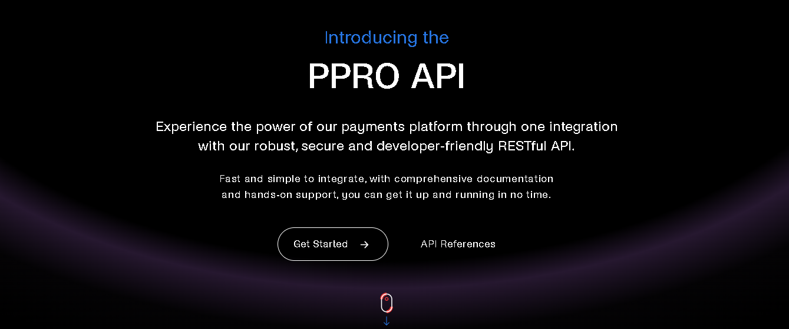

# Global Landing Page

Global Landing Page

## Getting started

To make it easy for you to get started with GitLab, here's a list of recommended next steps.


## Add your files

- [ ] [Create](https://docs.gitlab.com/ee/user/project/repository/web_editor.html#create-a-file) or [upload](https://docs.gitlab.com/ee/user/project/repository/web_editor.html#upload-a-file) files
- [ ] [Add files using the command line](https://docs.gitlab.com/ee/gitlab-basics/add-file.html#add-a-file-using-the-command-line) or push an existing Git repository with the following command:

```
cd existing_repo
git remote add origin https://gitlab.ppro.com/lucas.atala/global-landing-page.git
git branch -M master
git push -uf origin master
```

## Integrate with your tools

- [ ] [Set up project integrations](https://gitlab.ppro.com/lucas.atala/global-landing-page/-/settings/integrations)

## Collaborate with your team

- [ ] [Invite team members and collaborators](https://docs.gitlab.com/ee/user/project/members/)
- [ ] [Create a new merge request](https://docs.gitlab.com/ee/user/project/merge_requests/creating_merge_requests.html)
- [ ] [Automatically close issues from merge requests](https://docs.gitlab.com/ee/user/project/issues/managing_issues.html#closing-issues-automatically)
- [ ] [Enable merge request approvals](https://docs.gitlab.com/ee/user/project/merge_requests/approvals/)
- [ ] [Automatically merge when pipeline succeeds](https://docs.gitlab.com/ee/user/project/merge_requests/merge_when_pipeline_succeeds.html)

## Test and Deploy

Use the built-in continuous integration in GitLab.

- [ ] [Get started with GitLab CI/CD](https://docs.gitlab.com/ee/ci/quick_start/index.html)
- [ ] [Analyze your code for known vulnerabilities with Static Application Security Testing(SAST)](https://docs.gitlab.com/ee/user/application_security/sast/)
- [ ] [Deploy to Kubernetes, Amazon EC2, or Amazon ECS using Auto Deploy](https://docs.gitlab.com/ee/topics/autodevops/requirements.html)
- [ ] [Use pull-based deployments for improved Kubernetes management](https://docs.gitlab.com/ee/user/clusters/agent/)
- [ ] [Set up protected environments](https://docs.gitlab.com/ee/ci/environments/protected_environments.html)

***

## Netlify deploy

To impact over the landing page we require to build this application and then deploy to production on netlify. The stpes for this should be:

-- yarn build
--ntl deploy --prod

# Editing this README

When you're ready to make this README your own, just edit this file and use the handy template below (or feel free to structure it however you want - this is just a starting point!).  Thank you to [makeareadme.com](https://www.makeareadme.com/) for this template.

## Name
Global Landing Page

## Description
This SPA is intended to be a solution for a README landing page. SInce changes are not being reflected inmediately on README we propose the solution of an iframe embedded in README

## Visuals


## Installation
yarn install
Keep in mind that a simple html page is being rendered, but the first approach with React remains uploaded for references

## Support
Please communicate with PPRO Partner Interfaces Team for Support

## Authors and acknowledgment
Thanks to Joharvi, Kiki and Stuart for their contributions

## License
MIT License

